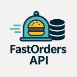

# fastorders-api

<!-- Improved compatibility of back to the top link: See: https://github.com/othneildrew/Best-README-Template/pull/73 -->
<a name="readme-top"></a>

<!-- PROJECT SHIELDS -->
<!--
*** Markdown "reference style" links for readability.
*** Reference links are enclosed in brackets [] instead of parentheses ().
-->

<!-- PROJECT LOGO -->
<br />
<div align="center">
  <a href="https://github.com/othneildrew/Best-README-Template">
    
  </a>

<h3 align="center">FastOrders API</h3>

  <p align="center">
    FastOrders API
    <br />
    <a href="https://github.com/jpcadena/fastorders-api"><strong>Explore the
docs
»</strong></a>
    <br />
  </p>
</div>

<!-- TABLE OF CONTENTS -->
<details>
  <summary>Table of Contents</summary>
  <ol>
    <li>
      <a href="#about-the-project">About the Project</a>
      <ul>
        <li><a href="end-to-end-pipeline">End-to-End Pipeline</a></li>
        <li><a href="#analytics-goals">Analytics Goals</a></li>
        <li><a href="#downstream-applications">Downstream Applications</a></li>
        <li><a href="#why-it-matters">Why It Matters</a></li>
      </ul>
    </li>
    <li>
      <a href="#getting-started">Getting Started</a>
      <ul>
        <li><a href="#prerequisites">Prerequisites</a></li>
        <li><a href="#installation">Installation</a></li>
      </ul>
    </li>
    <li><a href="#usage">Usage</a></li>
    <li><a href="#testing">Testing</a></li>
    <li><a href="#contributing">Contributing</a></li>
    <li><a href="#security">Security</a></li>
    <li><a href="#code-of-conduct">Code of Conduct</a></li>
    <li><a href="#license">License</a></li>
    <li><a href="#contact">Contact</a></li>
  </ol>
</details>

<!-- ABOUT THE PROJECT -->

## About the Project

![Project][project-screenshot]

**FastOrders API** is a RESTful API that handles order management. This backend project is a FastAPI-based template
designed to serve as a robust, reliable, and RESTful API backend. It is crucial for facilitating user authentication,
real-time monitoring, data processing, and an advanced alerting system. By leveraging the principles of RESTful
architecture, this API ensures standardized communication and a scalable, maintainable infrastructure for the associated
mobile application. This project is not only vital for the functionality it provides but also for ensuring the
scalability and maintainability of the overall solution.

<p align="right">(<a href="#readme-top">back to top</a>)</p>

### Built With

This project is built using a suite of modern, powerful technologies and frameworks to ensure high performance, ease of
development, and robustness:

#### Components

The system is composed of the following main components, each playing a
crucial role in providing a scalable, maintainable, and robust application:

- **FastAPI Backend**: Serves as the core of the RESTful API, handling incoming
  HTTP requests, processing data, and sending responses. It's designed for high
  performance and encourages standard API development practices.
- **PostgreSQL**: PostgreSQL is used for structured relational data
  storage.
- **JWT Authentication**: Implements secure authentication mechanisms using JSON
  Web Tokens (JWT), ensuring secure access to the API.

This project adheres to RESTful design principles, ensuring an intuitive and
standard approach to API development. This design facilitates easy integration,
scalability, and interaction with various clients, including web and mobile
applications. The API provides clear, resource-oriented URLs, uses HTTP response
codes to indicate API errors, and employs JWT for secure, stateless
authentication.

#### Language & Core Tools

[![Python][python-shield]][python-url]
[![Pydantic][pydantic-shield]][pydantic-url]
[![Starlette][starlette-shield]][starlette-url]
[![Uvicorn][uvicorn-shield]][uvicorn-url]
<a href="https://roman-right.github.io/beanie/"></a> [![Beanie][beanie-shield]][beanie-url]
[![HTML5][html5-shield]][html5-url]
[![CSS3][css3-shield]][css3-url]
[![Pytest][pytest-shield]][pytest-url]

#### Development & Code Quality

[![Ruff][ruff-shield]][ruff-url]
[![MyPy][mypy-shield]][mypy-url]
[![pre-commit-shield]][pre-commit-url]
[![GitHub Actions][github-actions-shield]][github-actions-url]
[![Dependabot][dependabot-shield]][dependabot-url]
[![Git][git-shield]][git-url]
[![GitHub][github-shield]][github-url]
[![License: MIT][license-shield]][license-url]
[![Docker][docker-shield]][docker-url]

#### 🛢Database & Persistence

[![PostgreSQL][postgresql-shield]][postgresql-url]
[![MongoDB][mongodb-shield]][mongodb-url]
[![JWT][jwt-shield]][jwt-url]

#### Environment & IDE

[![Visual Studio Code][visual-studio-code-shield]][visual-studio-code-url]
[![PyCharm][pycharm-shield]][pycharm-url]
[![Markdown][markdown-shield]][markdown-url]
[![Swagger UI][swagger-ui-shield]][swagger-ui-url]

<p align="right">(<a href="#readme-top">back to top</a>)</p>

<!-- GETTING STARTED -->

## Getting started

### Prerequisites

- [Python 3.13+][python-docs]

### Installation

1. Clone the **repository**

   ```bash
   git clone https://github.com/jpcadena/fastorders-api.git
   ```

2. Change the directory to **root project**

   ```bash
   cd fastorders-api
   ```

3. Create a **virtual environment** named *.venv* in the working directory

    ```bash
    uv venv
    ```

4. Activate **environment** in Windows

    ```bash
    .\venv\Scripts\activate
    ```

5. Activate **environment** in macOS or Linux

    ```bash
    source venv/bin/activate
    ```

6. Update project's environment by syncing all of its dependencies and installing them

    ```bash
    uv sync
    ```

<p align="right">(<a href="#readme-top">back to top</a>)</p>

<!-- USAGE EXAMPLES -->

## Usage

1. Execute with console

    ```bash
    python main.py
    ```

<p align="right">(<a href="#readme-top">back to top</a>)</p>

<!-- TESTING -->

## Testing

1. **Running tests:**

   To run all tests, you can run the following command in the root directory of the project:

   ```bash
   pytest .
   pytest tests/ --cov=src --cov-report=term-missing
   ```

2. **Running a specific test:**

   If you want to run a specific test, you can do so by specifying the file and test name. For example, the following
   command will only run the `test_get_users` test in the `test_main.py` file:

   ```bash
   pytest tests/test_main.py::test_get_users
   ```

3. **Understanding test results:**

   Pytest will provide a summary of the test results in the console. It will tell you how many tests passed and how many
   failed. For each failed test, Pytest will provide a detailed error message that can help you identify what went
   wrong.

4. **Writing new tests:**

   When you add new features to the application, you should also write corresponding test cases. Each test case should
   be a function that starts with the word 'test.' Inside the function, you can use `assert` statements to check that
   your code is working as expected. For example:

   ```python
   from src.infrastructure.models import User
   from src.infrastructure.services.user_service import add_user


   def test_add_user():
       user: User = add_user("testuser", "testpass")
       assert user.name == "testuser"
       assert user.password == "testpass"
   ```

   This function tests that the `add_user` function correctly creates a new user with the given name and password.

Remember to update your tests whenever you update your code. Maintaining a comprehensive test suite will help ensure the
reliability and robustness of your application.

<p align="right">(<a href="#readme-top">back to top</a>)</p>

<!-- CONTRIBUTING -->

## Contributing

[![GitHub][github-shield]][github-url]

Please read our [contributing guide](CONTRIBUTING.md) for details on our code of conduct, and the process for submitting
pull requests to us.

<p align="right">(<a href="#readme-top">back to top</a>)</p>

<!-- SECURITY -->

## Security

For security considerations and best practices, please refer to our [Security Guide](SECURITY.md) for a detailed guide.

<p align="right">(<a href="#readme-top">back to top</a>)</p>

<!-- CODE_OF_CONDUCT -->

## Code of Conduct

We enforce a code of conduct for all maintainers and contributors. Please read our [Code of Conduct](CODE_OF_CONDUCT.md)
to understand the expectations before making any contributions.

<p align="right">(<a href="#readme-top">back to top</a>)</p>

<!-- LICENSE -->

## License

Distributed under the MIT License. See [LICENSE](LICENSE) for more information.

<p align="right">(<a href="#readme-top">back to top</a>)</p>

<!-- CONTACT -->

## Contact

- [![LinkedIn][linkedin-shield]][linkedin-url]

- [![Outlook][outlook-shield]](mailto:jpcadena@espol.edu.ec?subject=[GitHub]fastorders-api)

<p align="right">(<a href="#readme-top">back to top</a>)</p>

<!-- MARKDOWN LINKS & IMAGES -->
<!-- https://www.markdownguide.org/basic-syntax/#reference-style-links -->

[project-screenshot]: assets/images/project.png

[python-docs]: https://docs.python.org/3.13/

[linkedin-shield]: https://img.shields.io/badge/linkedin-%230077B5.svg?style=for-the-badge&logo=linkedin&logoColor=white

[outlook-shield]: https://img.shields.io/badge/Microsoft_Outlook-0078D4?style=for-the-badge&logo=microsoft-outlook&logoColor=white

[python-shield]: https://img.shields.io/badge/python-3670A0?style=for-the-badge&logo=python&logoColor=ffdd54

[pycharm-shield]: https://img.shields.io/badge/PyCharm-21D789?style=for-the-badge&logo=pycharm&logoColor=white

[markdown-shield]: https://img.shields.io/badge/Markdown-000000?style=for-the-badge&logo=markdown&logoColor=white

[github-shield]: https://img.shields.io/badge/github-%23121011.svg?style=for-the-badge&logo=github&logoColor=white

[ruff-shield]: https://img.shields.io/endpoint?url=https://raw.githubusercontent.com/charliermarsh/ruff/main/assets/badge/v1.json

[mypy-shield]: https://img.shields.io/badge/mypy-checked-2A6DB2.svg?style=for-the-badge&logo=appveyor

[visual-studio-code-shield]: https://img.shields.io/badge/Visual_Studio_Code-007ACC?style=for-the-badge&logo=visual-studio-code&logoColor=white

[github-actions-shield]: https://img.shields.io/badge/github%20actions-%232671E5.svg?style=for-the-badge&logo=githubactions&logoColor=white

[pre-commit-shield]: https://img.shields.io/badge/pre--commit-F7B93E?style=for-the-badge&logo=pre-commit&logoColor=white

[pydantic-shield]: https://img.shields.io/badge/Pydantic-FF43A1?style=for-the-badge&logo=pydantic&logoColor=white

[beanie-shield]: https://img.shields.io/badge/Beanie-000000?style=for-the-badge&logoColor=white&color=white

[postgresql-shield]: https://img.shields.io/badge/PostgreSQL-336791?style=for-the-badge&logo=postgresql&logoColor=white

[dependabot-shield]: https://img.shields.io/badge/-Dependabot-025E8C?style=flat&logo=dependabot&logoColor=white
[mongodb-shield]: https://img.shields.io/badge/MongoDB-%234ea94b.svg?style=for-the-badge&logo=mongodb&logoColor=white
[pytest-shield]: https://img.shields.io/badge/pytest-%23ffffff.svg?style=for-the-badge&logo=pytest&logoColor=2f9fe3
[git-shield]: https://img.shields.io/badge/git-%23F05033.svg?style=for-the-badge&logo=git&logoColor=white

[starlette-shield]: https://img.shields.io/badge/Starlette-392939?style=for-the-badge&logo=starlette&logoColor=white

[uvicorn-shield]: https://img.shields.io/badge/Uvicorn-2A308B?style=for-the-badge&logo=uvicorn&logoColor=white

[html5-shield]: https://img.shields.io/badge/HTML5-E34F26?style=for-the-badge&logo=html5&logoColor=white

[jwt-shield]: https://img.shields.io/badge/JWT-black?style=for-the-badge&logo=JSON%20web%20tokens

[docker-shield]: https://img.shields.io/badge/docker-%230db7ed.svg?style=for-the-badge&logo=docker&logoColor=white

[license-shield]: https://img.shields.io/badge/License-MIT-yellow.svg

[css3-shield]: https://img.shields.io/badge/CSS3-1572B6?style=for-the-badge&logo=css3&logoColor=white

[swagger-ui-shield]: https://img.shields.io/badge/-Swagger-%23Clojure?style=for-the-badge&logo=swagger&logoColor=white
[linkedin-url]: https://linkedin.com/in/juanpablocadenaaguilar

[python-url]: https://docs.python.org/3.11/

[pycharm-url]: https://www.jetbrains.com/pycharm/

[markdown-url]: https://daringfireball.net/projects/markdown/

[github-url]: https://github.com/jpcadena/fastorders-api

[ruff-url]: https://beta.ruff.rs/docs/

[mypy-url]: http://mypy-lang.org/

[visual-studio-code-url]: https://code.visualstudio.com/

[github-actions-url]: https://github.com/features/actions

[pre-commit-url]: https://pre-commit.com/

[pydantic-url]: https://docs.pydantic.dev

[dependabot-url]: https://docs.github.com/en/code-security/getting-started/dependabot-quickstart-guide

[beanie-url]: https://roman-right.github.io/beanie/

[postgresql-url]: https://www.postgresql.org/

[mongodb-url]: https://www.mongodb.com/docs/atlas/atlas-ui/triggers/functions/api/

[pytest-url]: https://docs.pytest.org/en/stable/

[git-url]: https://git-scm.com/doc

[starlette-url]: https://www.starlette.io/

[uvicorn-url]: https://www.uvicorn.org/

[html5-url]: https://developer.mozilla.org/en-US/docs/Glossary/HTML5

[jwt-url]: https://jwt.io/

[swagger-ui-url]: https://swagger.io/

[docker-url]: https://www.docker.com/

[css3-url]: https://developer.mozilla.org/en-US/docs/Web/CSS

[license-url]: https://opensource.org/licenses/MIT
